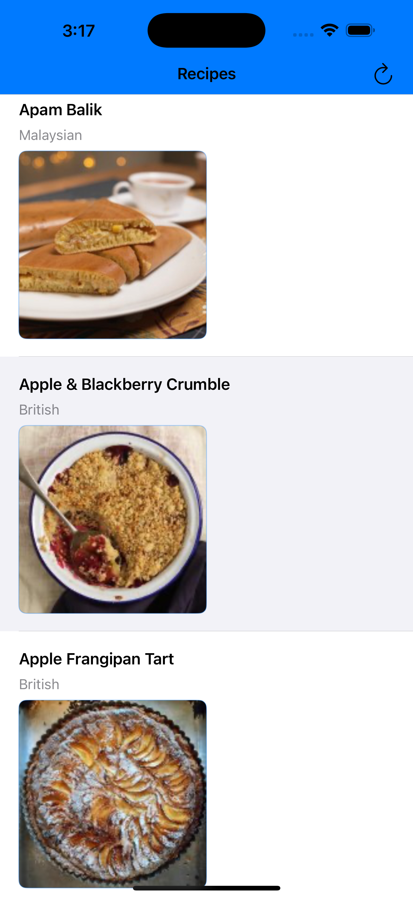
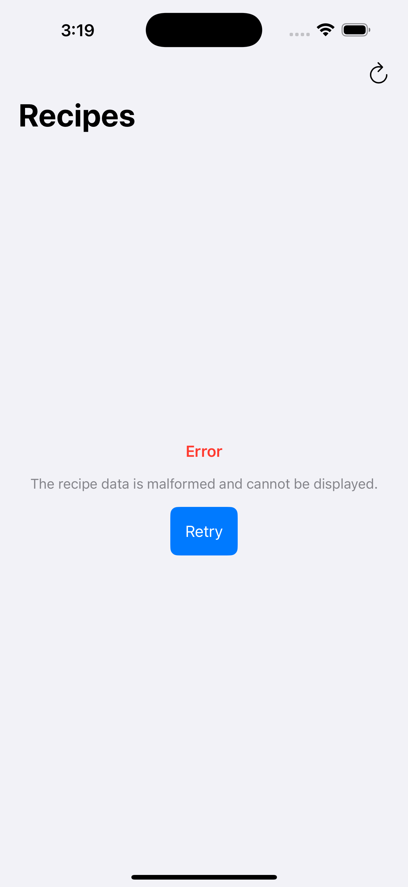
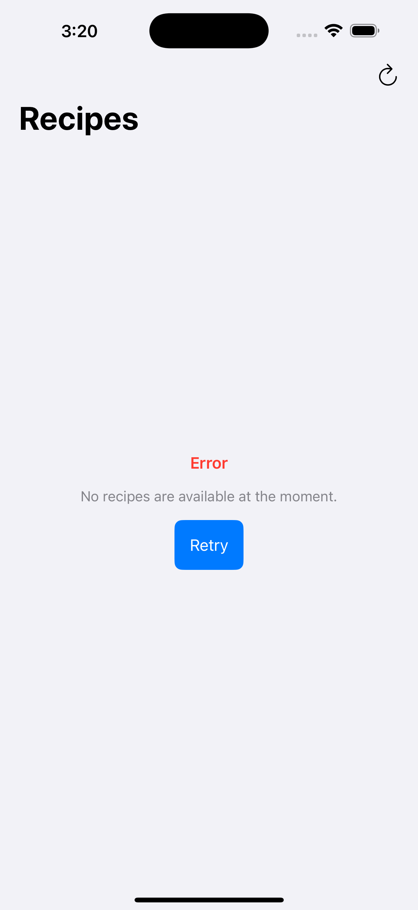

# RecipeApp

### Summary
The Recipe App is a SwiftUI-based application that fetches and displays recipes from a provided API endpoint. The app showcases the following features:
- **Recipe List**: Displays a list of recipes with their name, cuisine type, and photo.
- **Error Handling**: Gracefully handles malformed and empty data endpoints.
- **Image Loading**: Efficiently loads recipe images.

#### **Screenshots**
1. **Recipe Page**:
   
   - Displays a list of recipes with their name, cuisine type, and photo.

2. **Malformed Endpoint**:
   
   - Shows an error message when the data is malformed.

3. **Empty Endpoint**:
   
   - Displays an empty state when no recipes are available.

---

### Focus Areas
I prioritized the following areas in this project:
1. **Error Handling**:
   - Ensured the app gracefully handles malformed and empty data.
   - Implemented custom error types (`RecipeError.emptyData`, `RecipeError.malformedData`) to provide meaningful feedback.

2. **User Interface**:
   - Built a clean and intuitive UI using SwiftUI.
   - Ensured the app is responsive and user-friendly.

3. **Testing**:
   - Wrote unit tests to verify the app’s behavior with different API endpoints (functional, empty, malformed).
   - Focused on testing core logic, such as data fetching and error handling.

I chose to focus on these areas because they are critical for delivering a robust and user-friendly app within the limited time frame.

---

### Time Spent
I spent approximately **4 hours** working on this project. Here’s how I allocated my time:
- **Planning and Setup**: 30 minutes
- **Networking and Data Fetching**: 1 hour
- **Error Handling**: 1 hour
- **User Interface**: 1 hour
- **Testing and Debugging**: 30 minutes

---

### Trade-offs and Decisions
Given the limited time, I made the following trade-offs:
1. **Simplified Image Loading**:
   - Used a basic implementation for image loading without custom caching.
2. **Limited Testing**:
   - Wrote unit tests for the most critical scenarios but did not cover all edge cases.
3. **Basic UI**:
   - Prioritized functionality over advanced UI features.

